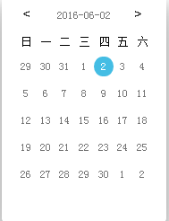
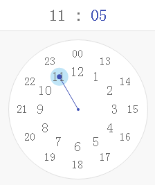
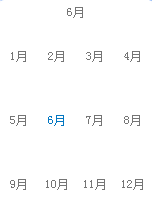
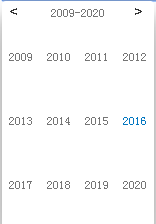

# datetimepicker
基于iUAP Design的日期相关控件

###项目 
  此项目提供了丰富的日期选择控件，主要为以下几种：

  * 日期时间控件（dateTime）
  * 时间控件（clockpicker 和time）
  * 年份控件 （year）
  * 月份控件（month）
  * 年月控件（yearmonth）
 
此地址可以克隆或fork本项目
			
		git clone   git@github.com:iuap-design/datetimepicker.git

###具体控件效果及说明

日期时间控件  [点击教程](https://github.com/iuap-design/datetimepicker/blob/master/docs/date.md) 

 时间控件   [点击教程](https://github.com/iuap-design/datetimepicker/blob/master/docs/clockpicker.md)

 月份控件   [点击教程](https://github.com/iuap-design/datetimepicker/blob/master/docs/month.md)

 年份控件   [点击教程](https://github.com/iuap-design/datetimepicker/blob/master/docs/year.md)

 年月控件   [点击教程](https://github.com/iuap-design/datetimepicker/blob/master/docs/yearmonth.md)

 
###依赖

此项目需要下载iuap-design中的button、ripple（弹出和点击效果）的样式已在vendor中的uui提供。

###方法
各个控件的方法可点击具体教程进行学习，以下是控件中常用方法。

######format
时间默认显示样式为“YYYY-MM-DD”，开发者可以自定义显示样式

	

        <input class="u-input" type="text" id="saaa">
    

	//显示效果为 2016-06-10 12:00

如果上例的format内容为“YYYY-MM-DD hh:mm:ss”显示效果为：2016-06-02 01:48:32

###与dataTable结合使用
定义完dataTable之后，需要在html元素中添加u-meta属性，u-meta包含的内容为id、type、data、field。

**id**：控件的id，具体值自行定义唯一即可。

**type**：控件类型。

clockpicker对应的type为“u-clockpicker”

dateTime对应的type为“u-datepicker”

month对应的type为“u-month”

year对应的type为“u-year”

yearmonth对应的type为“u-yearmonth”

time对应的type为“u-time”

**data**：对应dataTable的名称

**field**：dataTable中的字段名称

下面以dateTime为例

	

    	<input class="u-input" type="text">
	

dataTable的定义

	viewModel = {
        dt1: new u.DataTable({
            meta: {
                f1: {type:'date'}
            }
        })
    }

dataTable相结合的实例地址：https://github.com/iuap-design/datetimepicker/tree/master/examples/dataTable

